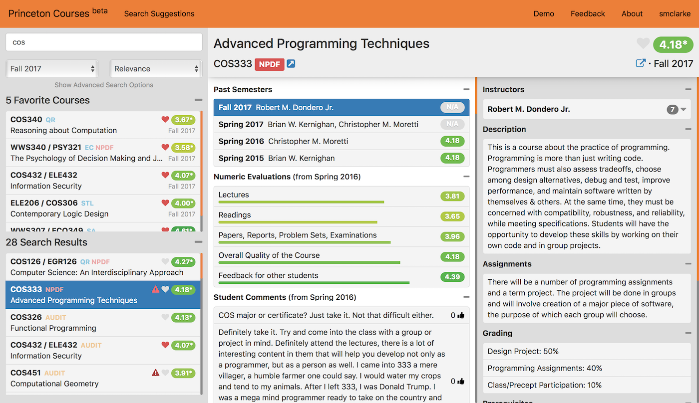

# Princeton Courses
This is a web app to explore Princeton University course listings and evaluations. You can access the app live at [princetoncourses.com](https://www.princetoncourses.com).

A screenshot of Princeton Courses in action.

## Authors
This app was made by Bensu Sicim, Caterina Golner, Kara Bressler, Mel Shu, and [Sebastian Hallum Clarke](http://www.zibity.com) as a project for Princeton's [COS 333](http://www.cs.princeton.edu/courses/archive/spring17/cos333/) in Spring 2017.

## Building
To build run this app on your own device, follow these instructions.

1. This app runs on the [Node.js](https://nodejs.org/) environment. If you don't already have this installed, [download]((https://nodejs.org/)) and install it. You can check if Node.js is installed by running `node -v` (this prints the version number of the installed copy of Node).
2. This app runs on [Heroku](http://www.heroku.com). If you don't already have the [Heroku CLI](https://devcenter.heroku.com/articles/heroku-cli) (Command Line Interface) installed, [download](https://devcenter.heroku.com/articles/heroku-cli) and install it. You can check if the Heroku CLI is installed by running `heroku -v` (this prints the version number of the installed copy of the Heroku CLI).
3. Clone this repository to your computer. You can either run `git clone https://github.com/sebthedev/PrincetonCourses.git` or use the [GitHub Desktop](https://desktop.github.com) app.
4. `cd` into the cloned repository.
5. Install dependencies by running `npm install`.
6. Princeton Courses needs to be connected to a MongoDB database. Create a file called `.env` that contains the text `MONGODB_URI='[URI POINTING TO YOUR MONGODB DATABASE]'`. You might like to use [mLab](https://www.mlab.com) to host your database.
7. Launch the app by running `heroku local web`. The app should now be running at [http://localhost:5000](http://localhost:5000).

## Accessing the database
Our database is a MongoDB database hosted on mLab. You can browse the database in a GUI using the [Robomongo app](https://robomongo.org).
